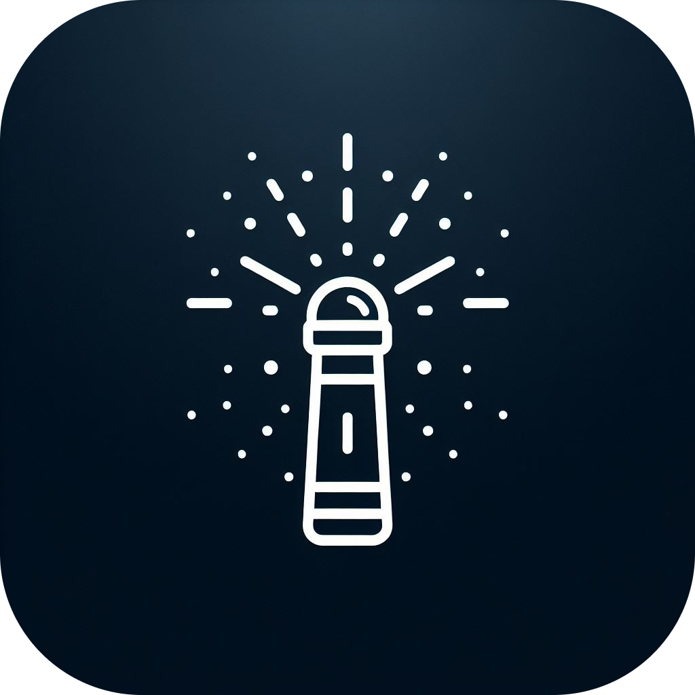

# LumoLight Privacy Policy

Your privacy is important to us. This Privacy Policy explains how LumoLight ("we", "us", or "our") collects, uses, and shares your information when you use our flashlight application ("App").

## Information We Collect

### Camera Permission

The App requires access to your device's camera in order to control the flashlight functionality. We only use the camera permission for the sole purpose of turning on and off the flashlight. We do not capture, store, or transmit any images or videos from your device.

### Usage Data

We may collect certain usage data, such as the frequency of app usage and device information (e.g., device model, operating system version), to improve the performance and functionality of the App. This data is collected anonymously and is not linked to your personal information.

## Data Security

We take reasonable measures to protect the security and confidentiality of your information. However, please be aware that no method of transmission over the internet or electronic storage is 100% secure and reliable, and we cannot guarantee absolute security.

## Third-Party Services

The App may include links to third-party websites or services. We are not responsible for the privacy practices or content of these third-party sites. We encourage you to review the privacy policies of any third-party sites you visit.

## Compliance with Google Play Store Camera Permissions Policy

We comply with Google Play Store's camera permissions policy by only using the camera permission for the intended purpose of controlling the flashlight. We do not access, collect, or use camera permissions for any other purpose.

## Changes to This Privacy Policy

We reserve the right to update or change our Privacy Policy at any time. Any changes to this Privacy Policy will be posted on this page. We encourage you to review this Privacy Policy periodically for any updates.

## Contact Us

If you have any questions or concerns about our Privacy Policy or our practices regarding your information, please contact us at [hello.crosby7@gmail.com](mailto:hello.crosby7@gmail.com).

This Privacy Policy was last updated on 2024-03-30.
